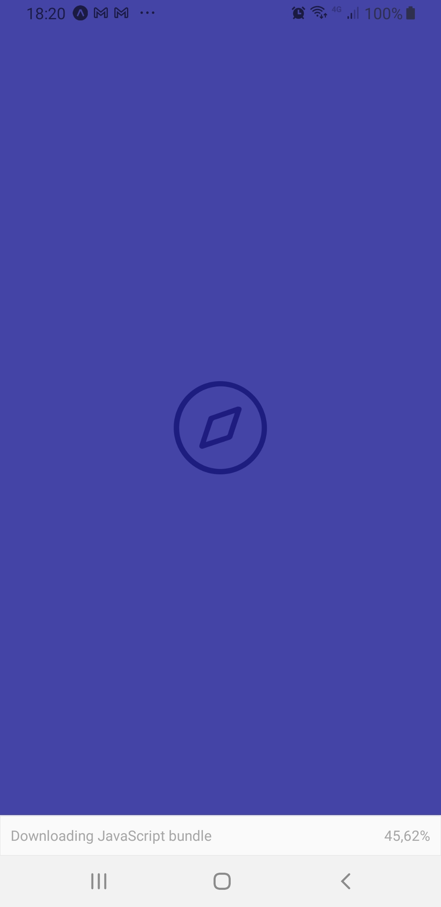
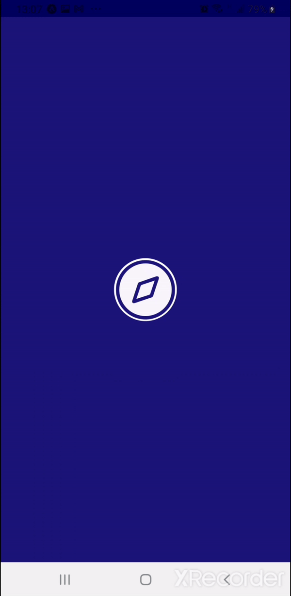
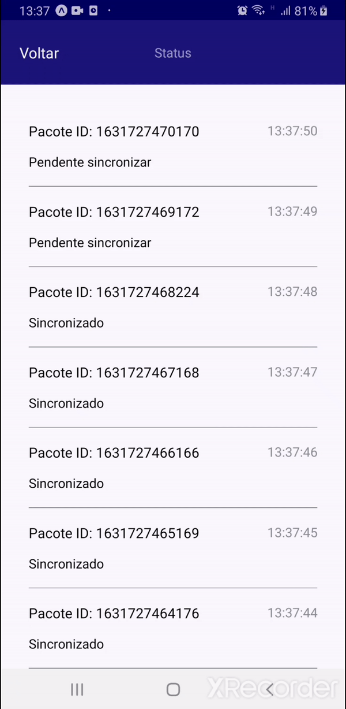

# My GPS - Tracking

<p align="center">

</p>

&nbsp;&nbsp;&nbsp;&nbsp;&nbsp;&nbsp;&nbsp;&nbsp;&nbsp;&nbsp;&nbsp;&nbsp;Aplicativo desenvolvido em typescript utilizando React-Native e Expo Bare workflow. Consiste na aquisição de dados de geolocalização, tais como latitude, longitude e velocidade, e no envio destes para o servidor. Em situações em que a conexão não é estabelecida (sombra), o aplicativo os armazena até que a conexão seja retomada e eles possam ser enviados.

## 📡 Api

&nbsp;&nbsp;&nbsp;&nbsp;&nbsp;&nbsp;&nbsp;&nbsp;&nbsp;&nbsp;&nbsp;&nbsp;Para que o app se comunique com a api é necessario alterar o arquivo `src/services/api.ts`, informando o endereço ip em que ela está localizada
```javascript
import axios from 'axios';

const api = axios.create({
	baseURL: 'http://localhost:8081'
	//altere a string a cima pelo endereço ip da api 
	//baseURL: 'http://xxx.xxx.xxx.x:8081'
});

api.defaults.timeout = 500;

export { api };
```

## 💻 Ambiente

&nbsp;&nbsp;&nbsp;&nbsp;&nbsp;&nbsp;&nbsp;&nbsp;&nbsp;&nbsp;&nbsp;&nbsp;Certifique-se de ter o Expo CLI instalado em sua máquina e o Expo Go em seu dispositivo conforme a [documentação do Expo](https://docs.expo.dev/get-started/installation/).

```
npm install --global expo-cli
```

Ferramentas | versão
:---        | ---:
node        | 15.7.0
yarn        |1.22.10
expo        |4.7.2


## ⚙ Bibliotecas

Biblioteca                                | Versão
:---                                      | ---:
@babel/core                               |7.15.5
@react-native-community/netinfo           |6.0.0
@react-navigation/native                  |6.0.2
@react-navigation/stack                   |6.0.7
@types/react                              |16.9.56
@types/react-native                       |0.63.53
@types/styled-components-react-native     |5.1.1
axios                                     |0.21.4
expo-location                             |12.1.2
expo-splash-screen                        |0.11.4
expo-status-bar                           |1.0.4
expo-updates                              |0.8.5
react-dom                                 |16.13.1
react-native-gesture-handler              |1.10.3
react-native-iphone-x-helper              |1.3.1
react-native-reanimated                   |2.2.1
react-native-responsive-fontsize          |0.5.1
react-native-safe-area-context            |3.2.0
react-native-screens                      |3.7.0
react-native-svg                          |12.1.1
react-native-svg-transformer              |0.14.3
react-native-unimodules                   |0.14.8
react-native-uuid                         |2.0.1
react-native-web                          |0.13.18
styled-components                         |5.3.1
typescript                                |4.0.8

## 📁 Diretório
```javascript
MyGPS-Tracking
  ╠═index.js
  ╠═ App.tsx
  ╚═src
     ╟─@types
     ║  ├─ declaration.d.ts
     ╟─assets
     ║  ├─ logo.svg
     ║  └─ splash.png
     ╠═components
     ║  ╠═ HeaderButton
     ║  ║  ├─ index.tsx
     ║  ║  └─ styles.ts
     ║  ╠═ SelectButton
     ║  ║  ├─ index.tsx
     ║  ║  └─ styles.ts
     ║  ╠═ Separator
     ║  ║  └─ index.tsx
     ║  ╚═ StatusCard
     ║     ├─ index.tsx  
     ║     └─ styles.ts 
     ╟─contexts
     ║  └─ StatusContext.tsx
     ╠═routes
     ║  ╚═ app.routes.tsx
     ╠═screens
     ║  ╠═ Home
     ║  ║  ├─ index.tsx
     ║  ║  └─ styles.ts
     ║  ╚═ Status
     ║     ├─ index.tsx
     ║     └─ styles.ts
     ╟─services
     ║  └─ api.ts
     ╚═styles
        ├─ styled.d.ts
        └─ theme.ts
```

## 🕒 Splash Screen

<p align= "center">

</p>

## 🏠 Home

<p align= "center">

</p>

## :clipboard: Status

<p align= "center">

</p>
